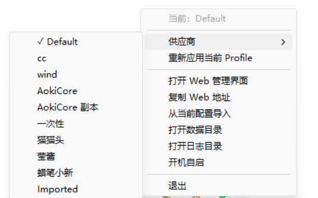
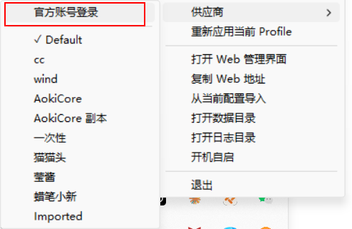
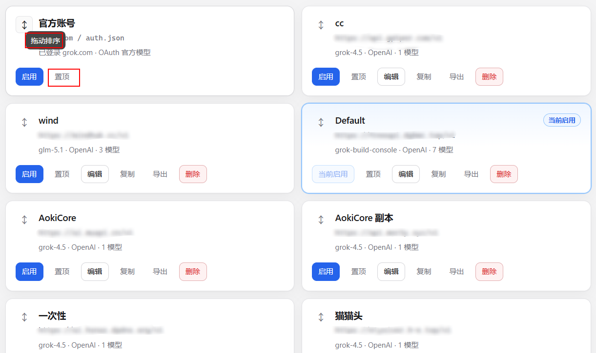
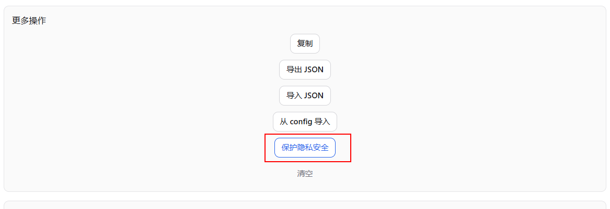
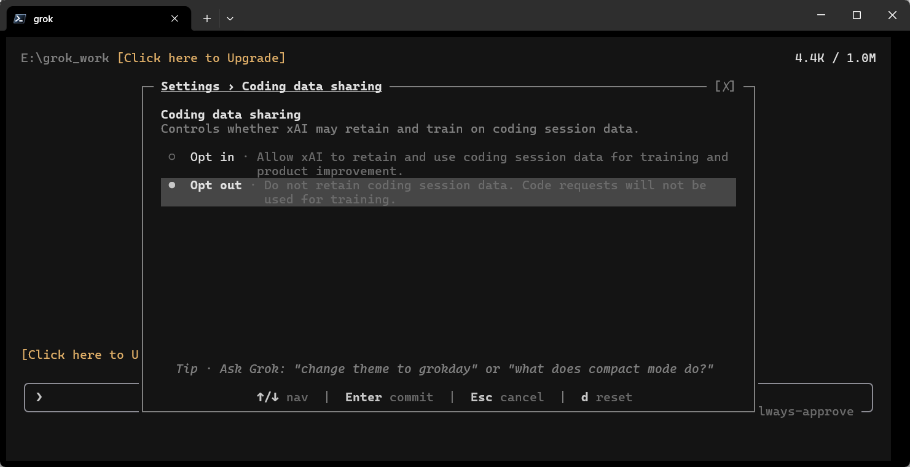
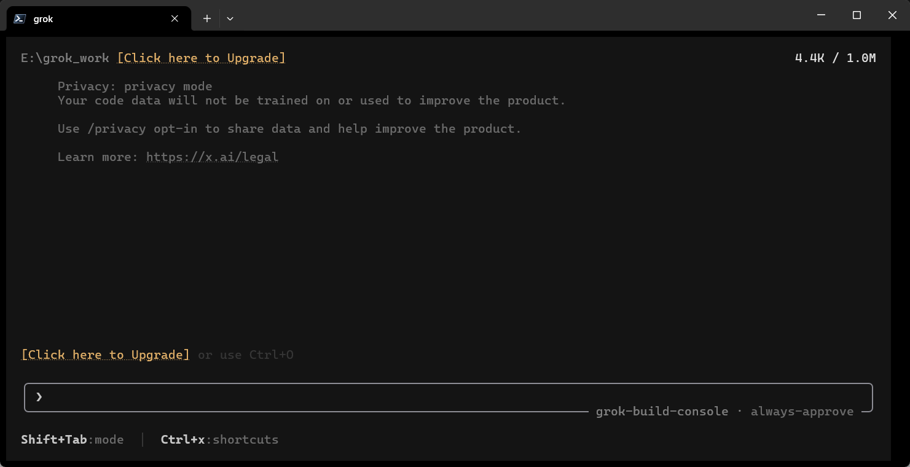

# grok_switch v0.2.0：官方账号切换、级联托盘与隐私保护

v0.2.0 扩展了 Grok Build 的登录方式管理。现在可以在 API 供应商与 Grok 官方账号之间切换，并支持在 WebUI 中调整卡片顺序、置顶常用登录方式和应用隐私保护配置。

<!-- more -->

## 版本更新

### 托盘供应商级联菜单

托盘中的供应商选择器由单层列表改为级联菜单。鼠标悬停在“供应商”上即可展开二级菜单，减少供应商较多时主菜单的长度。



### API 登录与 Grok 官方账号登录

新增“官方账号登录”入口，可以在两种模式之间切换：

- **官方账号**：使用 `~/.grok/auth.json` 中由 `grok login` 生成的 OAuth 登录凭据。
- **API 供应商**：使用 grok_switch 保存的 Base URL、API Key 和模型配置。

切换到官方账号时，只会清理当前 `config.toml` 中由供应商管理的 API 覆盖，不会删除保存在 `~/.grok_switch/profiles.json` 中的供应商档案。重新启用任意 API 供应商后，对应配置会再次写入 `config.toml`。



### 卡片拖动排序与置顶

WebUI 首页现在统一展示官方账号和 API 供应商。可以使用卡片左侧的拖动把手调整顺序，也可以将常用登录方式置顶。排序与置顶状态会保存到本地设置中，刷新页面或重启程序后仍然保留。



### 隐私保护配置

供应商编辑页的“更多操作”中新增“保护隐私安全”按钮。点击后会先备份当前 `config.toml`，再合并以下配置，并保留文件中的其他设置：

```toml
[features]
telemetry = false

[telemetry]
trace_upload = false
mixpanel_enabled = false

[harness]
disable_codebase_upload = true
```

其中 `telemetry`、`trace_upload` 和 `mixpanel_enabled` 用于减少遥测及 trace 上传。`disable_codebase_upload` 未出现在当前本机 Grok Build 用户指南中，是否生效取决于所安装的 Grok Build 版本，不能替代账号侧的数据共享设置。

参考：[cereblab 的 Grok 配置示例](https://gist.github.com/cereblab/dc9a40bc26120f4540e4e09b75ffb547)



## 数据隐私

### 关闭 Coding Data Sharing

在 Grok 中输入 `/settings` 打开设置，然后搜索 **Coding data sharing**，将状态从 **Opt in** 改为 **Opt out**。

这是账号服务端的数据共享设置，和 `config.toml` 中的本地遥测开关不是同一个功能。



### 将当前会话设置为隐私模式

在 Grok 中输入：

```text
/privacy
```

按照界面提示查看或调整当前账号的数据保留与隐私状态。



## 升级提示

升级到 v0.2.0 前建议先退出旧版托盘进程，再运行新版 `grok_switch.exe`。供应商档案和历史配置备份继续保存在 `~/.grok_switch` 目录中。
