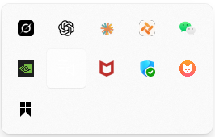
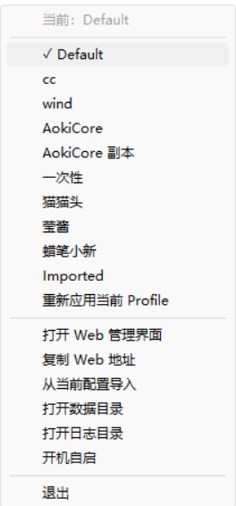
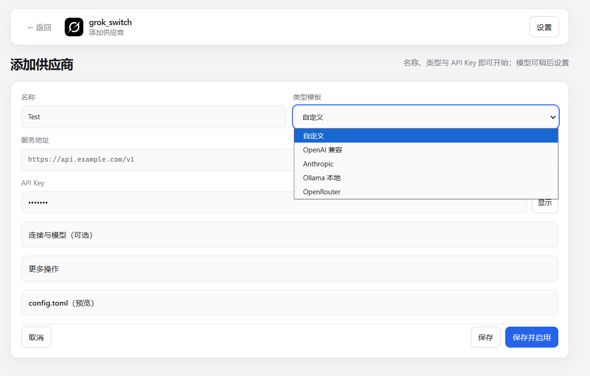
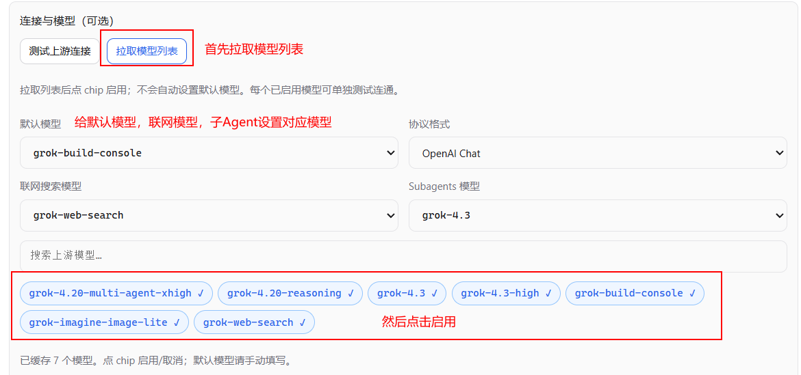
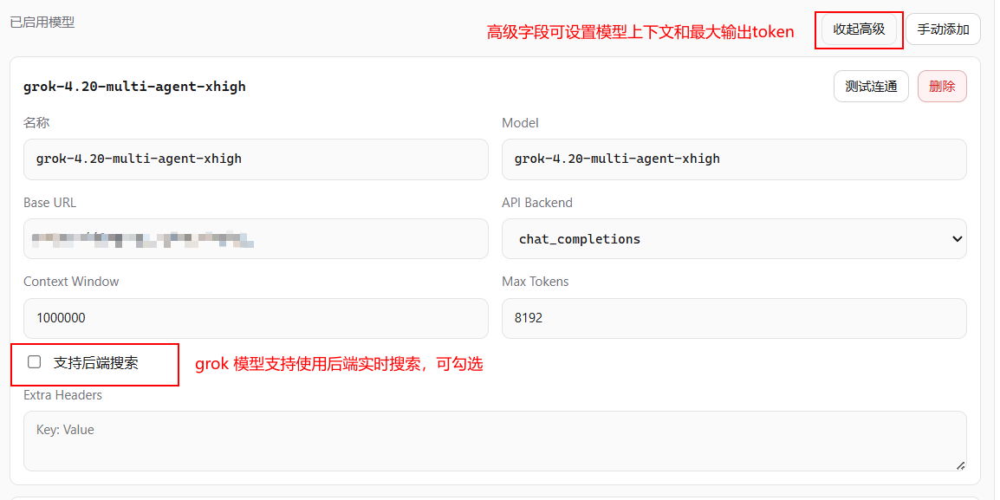
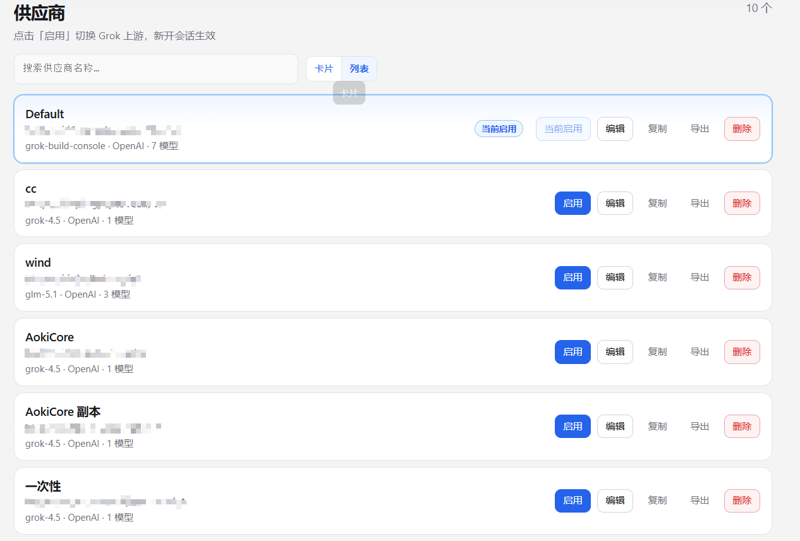
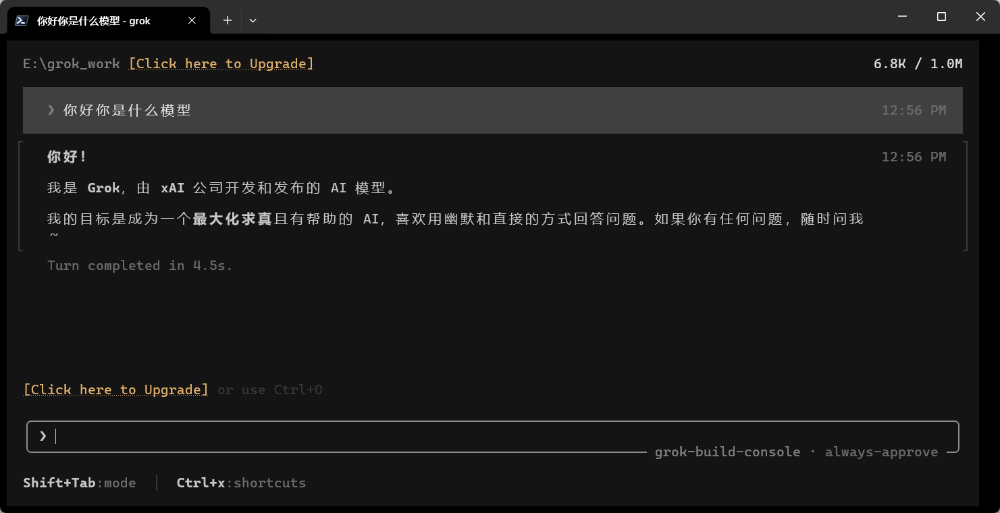

# Usage guide

## Install Grok Build

[Grok Build download link](https://grok.com/build)

If you have a SuperGrok account, just run `grok login` in a terminal — you don't need grok build switch. This project is for people who need to switch between upstream providers at any time.

## Grok Build Switch

### 1. Download and run `grok_switch.exe`

### 2. Open the local Web panel

### 3. Add a provider profile

### 4. Fetch and enable models

### 5. Save & activate the provider

### 6. Verify the Grok CLI config took effect

Type `grok` in a terminal to start grok and ask a question

### 7. Quick-switch from the tray menu

### 8. Back up and restore configs
