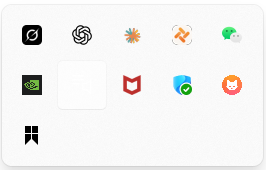
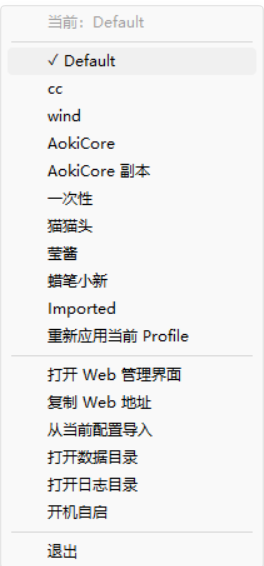
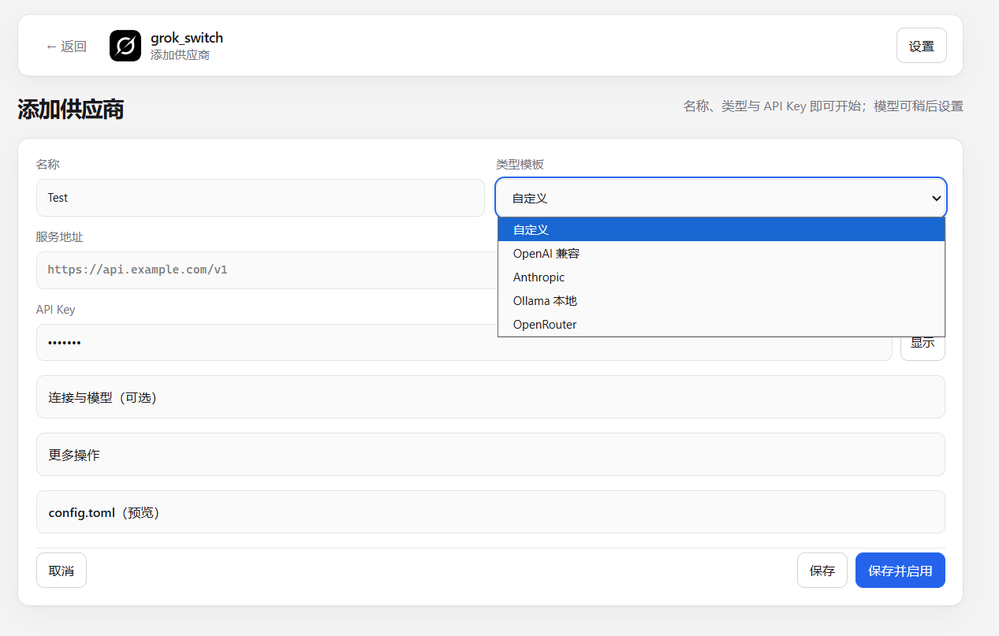
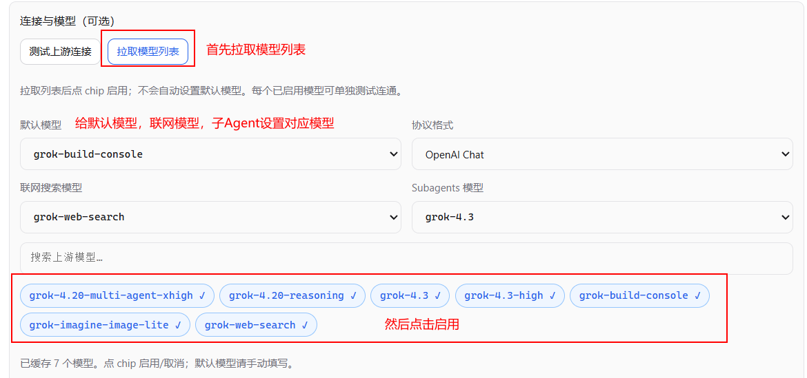
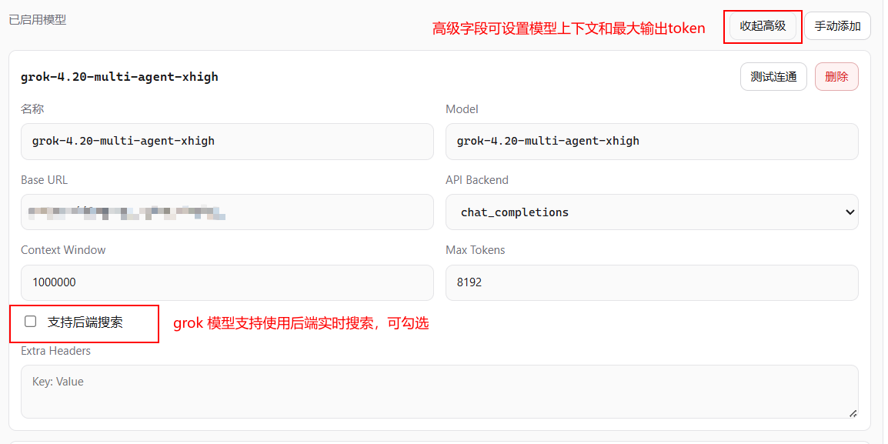
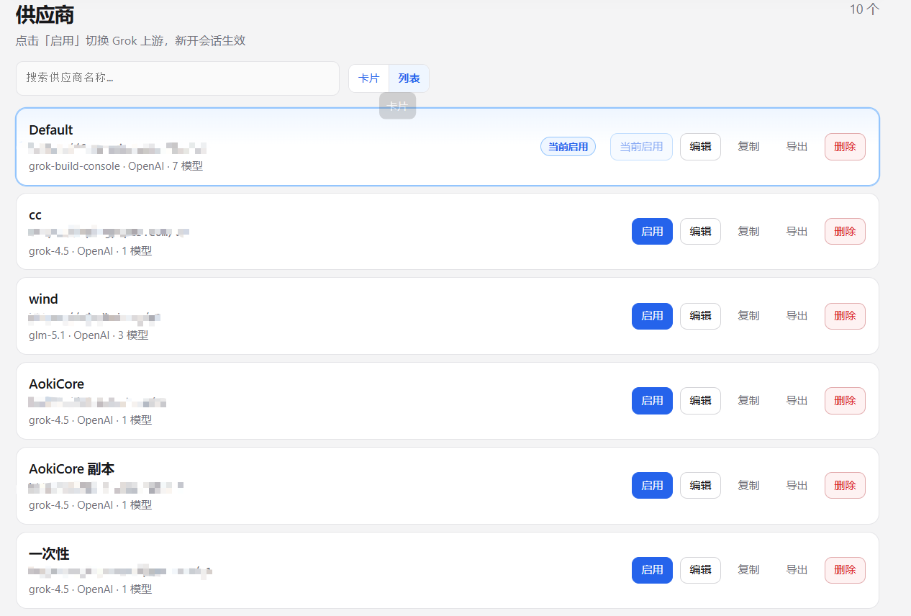
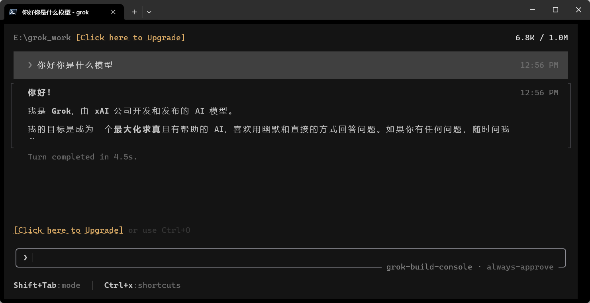

# 使用教程

## 安装Grok Build

[Grok Build 安装链接](https://grok.com/build) 

如果有supergrok账号请在终端直接grok login，不需要使用grok build switch，该项目适合随时切换上游供应商的情况。

## Grok Build Switch

### 1.下载并运行 `grok_switch.exe`

###  2.打开本地 Web 面板

###  3.添加供应商 Profile 

###  4.拉取并选择模型

###  5.保存并启用供应商

###  6.检查 Grok CLI 配置是否生效

在终端输入grok，启动grok然后进行问答

###  7.使用托盘菜单快速切换
###  8.备份和还原配置

